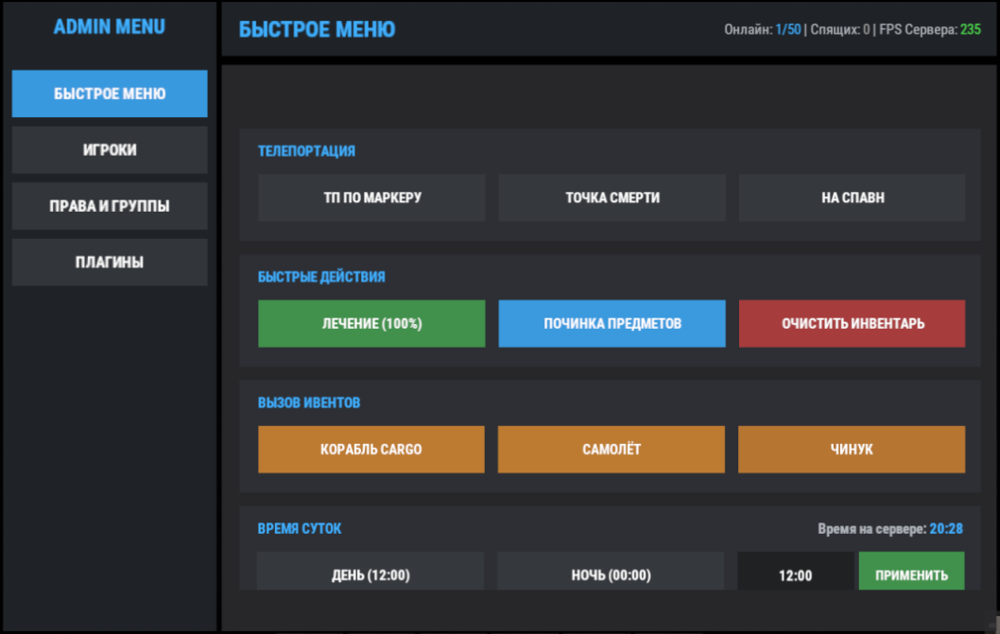
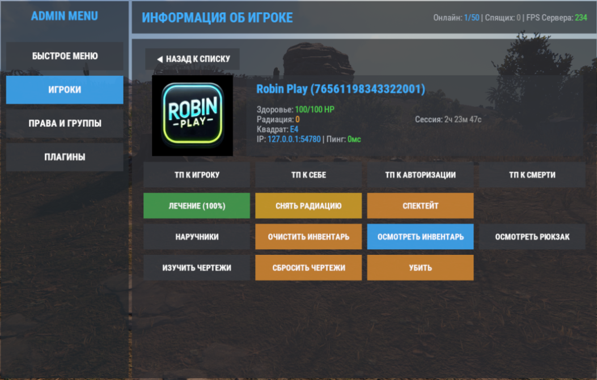

# RAdminMenu

**Описание** | [История обновлений](./RAdminMenu.changelog.md)

## Информация
- **Автор:** RustInnovate
- **Версия:** 2.0.2
- **Категория:** Бесплатные плагины

🛠️ ## RAdminMenu — всё администрирование сервера Rust в одном меню
Внутриигровое админ-меню для Oxide/uMod и Carbon. Никаких консольных команд — всё через красивый графический интерфейс: телепорты, действия над игроками, ивенты, время и погода, права, группы и менеджер плагинов.

⚡ **Возможности**

🏠 **Быстрое меню**

📍 Телепортация — ТП по маркеру, к точке смерти, на спавн
💊 Быстрые действия — лечение 100%, починка предметов, очистка инвентаря, креатив-режим (постройки без списания ресурсов)
🚁 Вызов ивентов — Patrol Helicopter, Bradley, Cargo Ship, самолёт с аирдропом, Чинук с учёными
🕐 Время суток — пресеты «День 12:00» / «Ночь 00:00» + ручной ввод
🌦️ Погода — пресеты Ясно / Дождь / Туман / Гроза / Сброс + детальные настройки

👥 **Игроки**

🔍 Список с поиском и фильтрами (онлайн / спящие)
🪪 Карточка игрока: аватар Steam, здоровье, радиация, квадрат, IP, пинг, длительность сессии
🎯 Действия: ТП к игроку / к себе / к авторизации / к точке смерти, лечение, снятие радиации, спектейт, наручники, осмотр инвентаря и рюкзака
⚠️ Опасные действия («Убить», «Очистить инвентарь», «Сбросить чертежи») — только после подтверждения в модальном окне с именем и SteamID цели

📜 **Чертежи — умная выдача и сброс**

✅ «Изучить чертежи» — выдаёт все чертежи и сохраняет дельту (что именно выдал плагин)
↩️ «Сбросить выданные» — отзывает ТОЛЬКО выданные плагином чертежи. Всё, что игрок изучил сам за скрап, не трогается!
🔄 «Сбросить чертежи» — полный сброс до ванильного состояния

🔑 **Права и группы**

➕ Создание, клонирование и удаление групп Oxide (с подтверждением)
🔀 Просмотр и переключение прав плагинов для групп и игроков

🧩 **Менеджер плагинов**

📋 Список всех плагинов с поиском, фильтрами и избранным
⬆️⬇️ Загрузка / выгрузка / перезагрузка прямо из игры

🌦️ **Детальная погода**

🎛️ Вкладки: Gameplay, Chances, Weather, Atmosphere, Clouds
🔧 Ручное задание любых погодных CONVAR'ов

🖥️ **Интерфейс**
📊 Шапка с онлайном, спящими и FPS — обновляется в реальном времени
↔️ Кнопки карточек в один ряд с горизонтальной прокруткой
📜 Вертикальный скролл не сбрасывается при нажатии кнопок
🎨 Всё оформление — в конфиге: размеры, позиции, цвета, тексты. Ноль хардкода!

⚙️ **Установка и доступ**

📂 Конфиг	oxide/config/RAdminMenu.json
🌍 Локализация	oxide/lang/ru и oxide/lang/en
💾 Данные	data/RSystem/RAdminMenu/
🔐 Доступ	Только authLevel 2 (овнеры)
💬 Открытие	Чат /admin или клавиша X (нажатие на X открывает и закрывает меню)

🧪 **Технические детали**

📦 Весь UI собирается в один CuiElementContainer и отправляется одним RPC-пакетом — минимум нагрузки на сеть
👁️ Спектейт через Harmony-патч BasePlayer.Tick_Spectator
🛡️ Защита от случайных действий — модальные подтверждения

⭐ Понравился плагин? Ставь звёздочку на GitHub и делись с другими админами! 
🐞 Нашёл баг или есть идея? Пишите — разберёмся!

