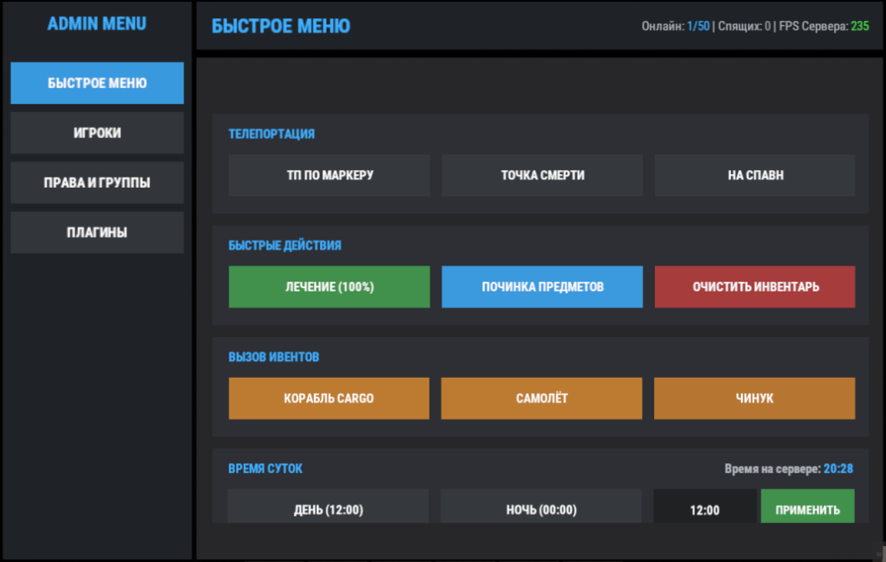
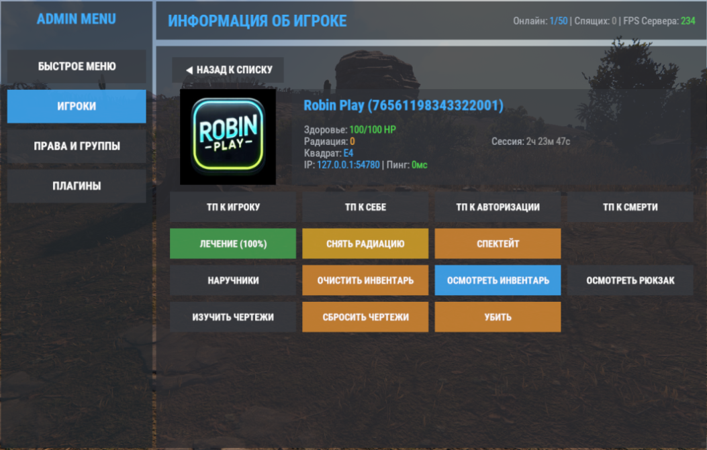

# RAdminMenu

**Описание** | [История обновлений](./RAdminMenu.changelog.md)

## Информация
- **Автор:** RustInnovate
- **Версия:** 2.0.3
- **Категория:** Бесплатные плагины

# RAdminMenu

Внутриигровое админ-меню для серверов Rust на Oxide/uMod & Carbon. Единый графический интерфейс для быстрого управления сервером: телепорты, действия над игроками, вызов ивентов, время суток, погода, права и группы, менеджер плагинов.

## Возможности

### Быстрое меню (главная страница)
- **Телепортация** — ТП по маркеру, к точке смерти, на спавн.
- **Быстрые действия** — лечение 100%, починка предметов в инвентаре, очистка своего инвентаря, креатив-режим (без списания ресурсов при постройке).
- **Вызов ивентов** — вертолёт (Patrol Helicopter), танк Bradley, корабль Cargo Ship, самолёт с аирдропом (cargo plane), чинук с учёными (CH47).
- **Время суток** — пресеты «День 12:00» / «Ночь 00:00», ручной ввод времени с применением.
- **Управление погодой** — пресеты Ясно / Дождь / Туман / Гроза / Сброс, переход в детальные настройки.

### Игроки
- Список игроков с поиском и фильтрами (онлайн/спящие).
- Карточка игрока: аватар Steam, здоровье, радиация, квадрат, IP, пинг, длительность сессии.
- Действия: ТП к игроку / к себе / к авторизации / к точке смерти, лечение 100%, снятие радиации, спектейт, наручники (нативная механика Rust), осмотр инвентаря и рюкзака, изучение и сброс чертежей, убийство.
- **Опасные действия** («Убить», «Очистить инвентарь», «Сбросить чертежи», «Сбросить выданные») выполняются только после подтверждения в модальном окне с именем и SteamID цели.

### Чертежи (два режима сброса)
- **«Изучить чертежи»** выдаёт игроку все чертежи и перед этим сохраняет в `data/RSystem/RAdminMenu/Blueprints/<steamid>.json` **дельту** — список чертежей, добавленных плагином.
- **«Сбросить выданные»** отзывает **только** выданные плагином чертежи. Чертежи, изученные игроком самостоятельно за скрап (до или после выдачи), не затрагиваются.
- **«Сбросить чертежи»** — полный сброс до ванильного состояния (остаются только дефолтные чертежи).
- Если дельта не найдена (игроку ещё не выдавали чертежи через меню), кнопка «Сбросить выданные» объясняет это и предлагает полный сброс.

### Права и группы
- Управление группами Oxide: создание, клонирование, удаление (с подтверждением).
- Просмотр и переключение прав (permissions) плагинов для групп и отдельных игроков.

### Плагины
- Список всех плагинов с поиском, фильтрами по статусу и избранным.
- Загрузка / выгрузка / перезагрузка плагинов.

### Погода (детальное управление)
- Пресеты погоды, отдельные вкладки: Gameplay, Chances, Weather, Atmosphere, Clouds.
- Ручное задание любых погодных CONVAR'ов.

## Интерфейс
- Меню центрировано по экрану, состоит из панели навигации, шапки с онлайном/спящими/FPS (обновляется в реальном времени) и области контента.
- Кнопки в карточках «Быстрого меню» расположены в один ряд с **горизонтальной прокруткой** внутри карточки.
- Вертикальный скролл контента не сбрасывается при нажатии кнопок-переключателей (точечное обновление элементов UI).
- Все размеры, позиции, цвета и тексты вынесены в конфиг и локализацию — ничего не захардкожено.

## Конфигурация
`oxide/config/RAdminMenu.json` — все панели, карточки, кнопки, цвета и отступы (ширина/высота/смещения «Влево-вправо / Вверх-вниз»). При отсутствии файла создаётся с дефолтными значениями.

## Локализация
`oxide/lang/en/RAdminMenu.json`, `oxide/lang/ru/RAdminMenu.json` — перезаписываются при загрузке плагина.

## Файлы данных
`data/RSystem/RAdminMenu/Blueprints/<steamid>.json` — дельты выданных плагином чертежей для кнопки «Сбросить выданные».

## Доступ и команды
- Доступ к меню: только игроки с **authLevel 2** (овнеры сервера; проверка по `connection.authLevel >= 2`).
- Открытие меню: чат-команда **`/admin`** или по нажатию кнопки **`X`** - открыть/закрыть меню
- Все внутренние команды интерфейса — консольные `radminmenu.*` (nav, act, qm, weather_*, perm_*, pl_*, pm_* и др.) и не предназначены для ручного ввода.

## Технические детали
- Весь интерфейс собирается в один `CuiElementContainer` и отправляется одним RPC-пакетом.
- Спектейт реализован через Harmony-патч `BasePlayer.Tick_Spectator`.
- Опасные действия проходят через модальное подтверждение (`radminmenu.act_confirmed`).

