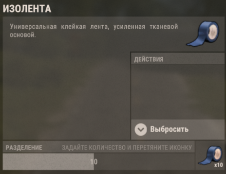

# RIzolenta

**Описание** | [История обновлений](./RIzolenta.changelog.md)

## Информация
- **Автор:** RustInnovate
- **Версия:** 1.0.0
- **Категория:** Бесплатные плагины

# 🩹 RIzolenta

Плагин для серверов **Rust** (Carbon / Oxide-совместимый), который превращает обычный **скотч (ducttape)** в **Изоленту** — универсальное средство быстрой починки оружия, брони и инструментов **без верстака, ресурсов и чертежей**.

Просто перетащите изоленту на предмет в инвентаре — и он починен! 🔧

---

## ✨ Возможности

- 🩹 **Починка перетаскиванием** — переносите изоленту на оружие, броню или инструмент, и он чинится.
- 📦 **Починка целым стаком** — плагин расходует ровно столько изоленты, сколько нужно до полной починки. Лишнее не тратится!
- ⚖️ **Честная система износа** — износ списывается **один раз за починку**, как на верстаке, независимо от количества израсходованной изоленты. Копить стак — выгодно!
- 🎁 **Изолента в луте** — появляется в ящиках и бочках (список настраивается).
- 🏷️ **Переименование предмета** — вся изолента от плагина отображается как «Изолента», а не «Скотч».
- 🔒 **Чёрный список** — запрет починки отдельных предметов (например, легендарного снайперского оружия).
- 🚫 **Запрет изучения** — изоленту нельзя изучить на исследовательском столе (крафтить её всё равно негде).
- ⌨️ **Консольная команда** — выдача изоленты администратором.

---

## ⚙️ Конфигурация

Файл: `carbon/config/RIzolenta.json`

```json
{
  "Список ящиков и бочек где будет появляться изолента": [
    "crate_normal_2",
    "crate_tools",
    "loot_barrel_1",
    "loot_barrel_2"
  ],
  "Чёрный список": [
    "rifle.l96"
  ],
  "Мин кол-во выпадение": 1,
  "Макс кол-во выпадение": 2,
  "Шанс выпадения": 50.0,
  "Скин изоленты": 3811198690,
  "Сколько чинить?": 10.0,
  "Сколько снимать хп от максимального хп?": 5.0
}
```

| Параметр | Описание |
|---|---|
| 📦 **Список ящиков и бочек** | Shortname контейнеров, в луте которых встречается изолента |
| 🚫 **Чёрный список** | Shortname предметов, которые **нельзя** починить изолентой |
| 🔢 **Мин / Макс кол-во выпадение** | Диапазон количества изоленты в одном контейнере |
| 🎲 **Шанс выпадения** | Шанс появления изоленты в контейнере (в процентах) |
| 🎨 **Скин изоленты** | Skin ID изоленты (только она чинится; обычный скотч без скина — нет) |
| 🔧 **Сколько чинить?** | Сколько % прочности восстанавливает **1 шт.** изоленты |
| 📉 **Сколько снимать хп от макс. хп?** | Сколько % макс. прочности списывается **за одну починку** (не за штуку!) |

### 🧮 Пример расчёта

Сломанный предмет `0/100`, конфиг по умолчанию (+10% / -5%):

| Действие | Результат |
|---|---|
| Починка стаком изоленты до полного | `100/100` → износ → **`95/95`** (потеря 5%, как на верстаке) |
| Починка 1 шт. изоленты | `0/100` → `10/100` → износ → **`5/95`** (потеря те же 5%, но починки меньше) |

👉 Вывод: износ одинаков, а восстановления больше — **выгоднее копить изоленту и чиниться сразу большим стаком**.

---

## ⌨️ Команды

### Консоль (только для администраторов)

```
giveizolenta <steamid> <кол-во>
```

Выдаёт игроку изоленту (с скином и именем из конфига). Если в инвентаре нет места — падает под ноги.

Пример: `giveizolenta 76561198000000000 10`

---

## 📥 Установка

1. Скопируйте `RIzolenta.cs` в папку плагинов сервера:
   - Carbon → `carbon/plugins/`
   - Oxide → `oxide/plugins/`
2. Плагин скомпилируется автоматически, конфиг создастся при первом запуске.

---

## 🧠 Как это работает (для разработчиков)

- Починка перехватывает хук `CanMoveItem` — единственная серверная точка, где игра сообщает, что игрок перетаскивает предмет (drag&drop через `PlayerInventory.MoveItem`).
- Лут добавляется через хук `OnLootSpawn` (вызывается при генерации лута у ящиков **и** разбиваемых бочек).
- Изучение блокируется хуком `CanResearchItem` на исследовательском столе.
- Имя «Изолента» задаётся через механизм кастомных имён предметов (`item.name`) и локализацию плагина (ru/en).

## 📄 Лицензия

Распространяется свободно для использования на игровых серверах Rust.

