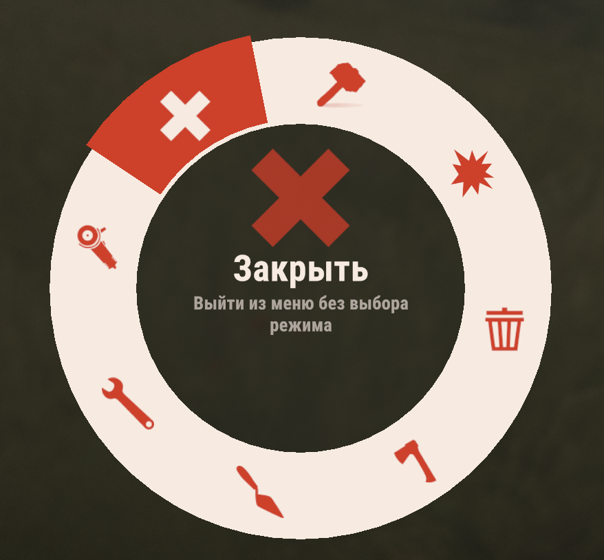
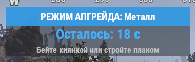

# RRemove

**Описание** | [История обновлений](./RRemove.changelog.md)

## Информация
- **Автор:** RustInnovate
- **Версия:** 1.6.7
- **Категория:** Бесплатные плагины

<div align="center">

# 🔨 RRemove

### Режимное удаление построек и предметов с возвратом ресурсов, автоапгрейдом и DLC скинами построек

🧱 Ремув • 📈 Автоапгрейд • 🎨 Скины построек • 🛡️ Рейд и комбат блок • 🌐 RU и EN

Версия 1.6.6 • Автор RustInnovate • Oxide и Carbon

</div>

## 📖 Описание

**RRemove** это продвинутый инструмент удаления построек для серверов Rust. Здесь нет ремува «просто молотком»: игрок открывает нативное радиальное меню одной клавишей, выбирает режим и работает с живым таймером на экране. Сервер строго проверяет права владения, авторизацию в шкафу, клан, команду, рейд и комбат блоки.

Каждое удаление возвращает ресурсы или сами объекты по настраиваемым процентам. Режим автоапгрейда поднимает постройки до нужного уровня строительным планом или киянкой, с выбором DLC скинов и цветов палитры прямо в колесе меню.

## ✨ Возможности

### 🔨 Удаление

- 🎯 Три режима: обычный с полными проверками, админский без проверок владения и снос целого строения
- 🎛️ Нативное радиальное pie меню клиента Rust, а не самодельная CUI панель
- 💰 Гибкий возврат: три независимых процента для построек, предметов и ресурсов из ящиков
- 📦 Возврат деплояблов самими предметами (сундуки, печки) вместо ресурсов, с настраиваемой потерей прочности
- ⏱️ GUI индикатор режима с обратным отсчётом, таймер сбрасывается после каждого действия
- 🚫 Чёрный список shortname с поддержкой префиксов, сравнение и по энтити, и по предмету деплоя
- ⛏️ Защита карьеров: нельзя удалить работающий карьер, с недожжённым дизелем, с замком или с содержимым
- ⌛ Опциональный лимит времени на удаление свежепоставленных объектов и привилегия исключения

### 📈 Автоапгрейд

- 🪓 Четыре уровня: дерево, камень, металл и МВК, строительным планом и ударами киянки
- 🔄 Таймер режима с автосбросом после каждого успешного апгрейда
- 🧾 Честная ванильная стоимость апгрейда и отдельная привилегия бесплатного апгрейда для админов
- 🗄️ Опциональное требование авторизации в строительном шкафу

### 🎨 Скины построек

- 🎭 Все DLC скины построек с серверной проверкой владения через Steam инвентарь
- 🔁 Листание скинов клавишами Q и E прямо у пунктов апгрейда в главном меню
- 🌈 Колесо выбора цвета для скинов с палитрой (транспортные контейнеры), как у баллончика
- 🎲 Режим случайного цвета палитры для каждого блока
- 📝 Автозаполнение списков скинов из игровых данных, названия редактируются в файлах локализации
- 🔓 Привилегия бесплатного доступа ко всем скинам для администраторов

### 🛡️ Безопасность

- 🏴 Интеграция с внешними плагинами RaidBlock, NoEscape и CombatBlock
- 🛠️ Или полностью встроенная система блокировки: взрыв по строению и ПВП урон блокируют меню и режимы
- 👥 Тонкая настройка доступа к чужим объектам: авторизация в шкафу, клан и команда отдельными флагами

## 🎮 Управление

Клавиша активации настраивается в конфиге, по умолчанию Z. Игроку достаточно один раз выполнить в консоли F1:

```
bind z rremove.menu
```

| 💻 Команда | 📝 Описание |
| :--- | :--- |
| `rremove.menu` | Открыть радиальное меню режимов |
| `rremove.toggle` | Циклическое переключение режимов для бинда на вторую клавишу |
| `rremove.skins` | Список найденных в игре скинов построек с их ID, для консоли сервера |

💡 Подсказка с готовой командой бинда автоматически показывается игроку при первом взятии киянки в руки, ровно до первого использования режима.

💡 Чат команды нет намеренно: весь доступ к функциям только через радиальное меню и бинды клавиш.

### 🎡 Радиальное меню

| Пункт | 📝 Описание |
| :--- | :--- |
| 🎯 Простой ремув | Удаление своих объектов с возвратом ресурсов |
| 👑 Админский ремув | Удаление любых объектов без проверок владения |
| 🏢 Удаление строения | Мгновенный снос всех объектов строения без возврата |
| 🪵 Дерево | Автоапгрейд построек в дерево |
| 🪨 Камень | Автоапгрейд построек в камень |
| ⚙️ Металл | Автоапгрейд построек в металл |
| 💎 МВК | Автоапгрейд построек в высококачественный металл |
| ❌ Закрыть | Выйти из меню без выбора режима |

## 🔑 Привилегии

| 🔑 Привилегия | 📝 Описание |
| :--- | :--- |
| `rremove.use` | Доступ к обычному ремуву и радиальному меню |
| `rremove.admin` | Админский ремув и удаление строения, уровень администратора больше не даёт доступ |
| `rremove.upgrade` | Режим автоапгрейда построек |
| `rremove.nocost` | Автоапгрейд без затрат ресурсов |
| `rremove.skinsfree` | Бесплатное использование любых скинов построек в обход DLC |
| `rremove.ignore` | Игнорирование лимита времени удаления, имя привилегии настраивается в конфиге |

Выдача прав:

```
oxide.grant group default rremove.use
oxide.grant user Игрок rremove.admin
```

## ⚙️ Конфигурация

Все настройки вынесены в конфиг, в коде нет ни одного захардкоженного значения. Позиция GUI панелей задаётся офсетами в едином формате: высота, ширина, вверх вниз, влево вправо. Каждая панель настроек это отдельный класс.

### 🛠️ Настройки ремува

- ⏱️ Время действия режима удаления
- 💶 Проценты возврата для построек, предметов и ресурсов из ящиков
- 📦 Возврат деплояблов предметами и процент потери прочности
- 🔐 Правила доступа: чужие объекты по шкафу, свои без шкафа, соклановцы, команда
- 🚫 Чёрный список shortname, по умолчанию: большие и промышленные печи, костры, фонари, нефтекубрик
- ⌛ Лимит времени удаления свежих объектов и привилегия исключения
- 🏴 Рейд и комбат блок: внешний плагин или встроенная система с настраиваемыми длительностями
- ⌨️ Клавиша активации и подсказка о бинде при взятии киянки

### 📈 Настройки апгрейда

- ⏱️ Время действия режима апгрейда со сбросом при каждом действии
- 🔓 Привилегии использования и бесплатного апгрейда
- 🗄️ Требование шкафа для автоапгрейда

### 🎨 Настройки скинов построек

- 🧩 Включение скинов и пейджера Q и E в главном меню
- 🌈 Колесо выбора цвета для скинов с палитрой и пункт случайного цвета
- 🖼️ Иконки цветовых пунктов меню
- 📋 Списки скинов по каждому типу апгрейда и автозаполнение из игровых данных

### 🖥️ GUI

- 🎨 Панель индикатора режима: размеры, цвета, шрифты и позиция офсетами
- 🖼️ Иконки всех пунктов радиального меню

## 🧩 API для разработчиков

| 🔌 Метод | 📝 Описание |
| :--- | :--- |
| `canRemove(BasePlayer player, BaseEntity entity)` | Проверка возможности удаления: null разрешено, строка причина запрета |
| `OnRemoveActivate(ulong playerId)` | Возвращает true, если у игрока сейчас активен режим удаления |
| `RemoveDeativate(ulong playerId)` | Принудительно выключает режим удаления игрока |

Другие плагины могут запретить удаление своего объекта, вернув строку из хука `canRemove`, причина будет показана игроку:

```csharp
private object canRemove(BasePlayer player, BaseEntity entity)
{
    if (entity.ShortPrefabName == "my.entity")
        return "Этот объект удалять нельзя";

    return null;
}
```

## 🌐 Локализация

Плагин полностью локализован: русский и английский языки из коробки. Названия скинов построек регистрируются автоматически ключами `Skin{ID}` и редактируются в файлах `lang/ru/RRemove.json` и `lang/en/RRemove.json` без правки конфига.

## 📦 Установка

1️⃣ Скопируйте `RRemove.cs` в папку плагинов сервера: `oxide/plugins` или `carbon/plugins`

2️⃣ Выдайте нужные привилегии игрокам и группам

3️⃣ При необходимости настройте конфиг и перезагрузите плагин

## 📋 Требования

- 🎮 Сервер игры Rust
- ⚙️ Oxide (uMod) или Carbon

<div align="center">

🔨 RRemove, версия 1.6.6, автор RustInnovate

⭐ Поставьте звезду, если плагин оказался полезен

</div>


