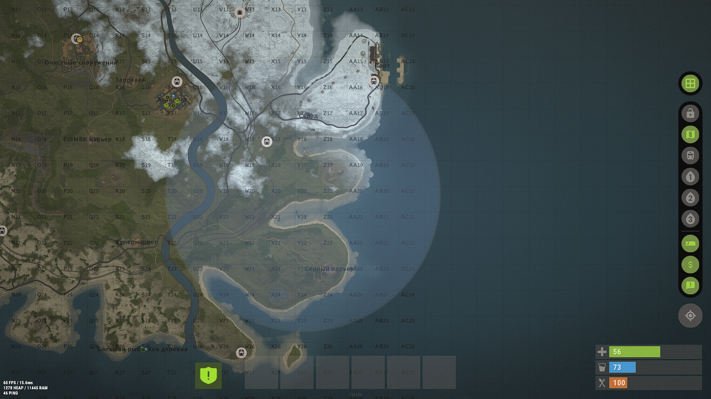
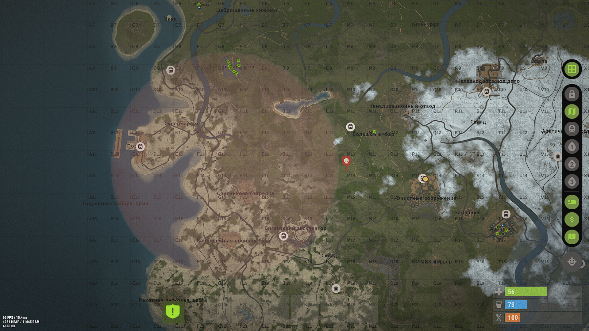

# ZoneDomes

[Описание](./ZoneDomes.md) | [История обновлений](./ZoneDomes.changelog.md)

## Информация
- **Автор:** Robin Play
- **Версия:** 2.0.3
- **Категория:** Бесплатные плагины

# ZoneDomes

**Версия:** 2.0.3  
**Автор:** Robin Play  
**Зависимости:** ZoneManager

## Описание

Плагин для автоматического отображения зон из ZoneManager в виде куполов в игре и кругов на карте G. Полностью автоматизирован для работы с ZoneManager.

### Что делает плагин

- ✅ Создаёт визуальные купола (сферы) в игре для каждой зоны из ZoneManager
- ✅ Отображает зоны на карте G (клавиша G) цветными кругами
- ✅ Автоматически синхронизируется с ZoneManager — радиус и название берутся автоматически
- ✅ Поддерживает различные типы куполов: Standard (серый), Red, Blue, Green, Purple (BR-сферы)
- ✅ Настраиваемая прозрачность маркеров на карте

## Как работает

1. **При запуске сервера:**
   - Если конфиг пуст, автоматически заполняется всеми зонами из ZoneManager
   - Создаются купола и маркеры на карте для всех зон из конфига
   - Для зон из ZoneManager, которых нет в конфиге, создаются записи с типом Standard

2. **При создании новой зоны в ZoneManager:**
   - Для новых зон нужно перезагрузить плагин: `oxide.reload ZoneDomes`
   - Плагин автоматически обнаружит новую зону при перезагрузке
   - Добавит запись в конфиг с именем зоны
   - Создаст купол и маркер на карте согласно глобальным флагам

3. **Радиус и название зоны:**
   - Радиус всегда берётся из ZoneManager
   - Название зоны подтягивается автоматически из ZoneManager
   - Не нужно настраивать эти параметры в конфиге ZoneDomes

## Конфигурация

Файл: `config/ZoneDomes.json`

```json
{
  "Прозрачность маркера": 0.25,
  "Отображать на карте": true,
  "Отображать купол": true,
  "Зоны": {
    "94567581": {
      "Название": "test 1",
      "Тип (число 0..4: 0=Standard, 1=Red, 2=Blue, 3=Green, 4=Purple)": 1
    },
    "78688720": {
      "Название": "test 2",
      "Тип (число 0..4: 0=Standard, 1=Red, 2=Blue, 3=Green, 4=Purple)": 2
    }
  }
}
```

### Параметры конфига

#### Глобальные настройки

- **"Прозрачность маркера"** (`float`) — прозрачность кругов на карте G (0.0–1.0, рекомендуется 0.25)
- **"Отображать на карте"** (`bool`) — включить/выключить отображение зон на карте G
- **"Отображать купол"** (`bool`) — включить/выключить отображение куполов в игре

#### Настройки зон ("Зоны")

Каждая зона настраивается по её ID из ZoneManager:

- **"Название"** (`string`) — имя зоны из ZoneManager (заполняется автоматически)
- **"Тип"** (`int`) — тип сферы (0–4):
  - `0` = Standard (серый)
  - `1` = Red (красный BR)
  - `2` = Blue (синий BR)
  - `3` = Green (зелёный BR)
  - `4` = Purple (фиолетовый BR)

## Установка

1. Убедитесь, что установлен плагин **ZoneManager**
2. Скопируйте `ZoneDomes.cs` в папку `plugins/`
3. Перезапустите сервер или выполните `oxide.reload ZoneDomes`
4. Отредактируйте `config/ZoneDomes.json` для настройки цветов зон

## Примечания

- Плагин работает полностью автоматически, ручное управление не требуется
- Цветные BR-сферы (Red, Blue, Green, Purple) видны только при взаимодействии с поверхностями мира
- Стандартная серая сфера всегда видна независимо от окружения
- Для новых зон нужно перезагрузить плагин: `oxide.reload ZoneDomes`



